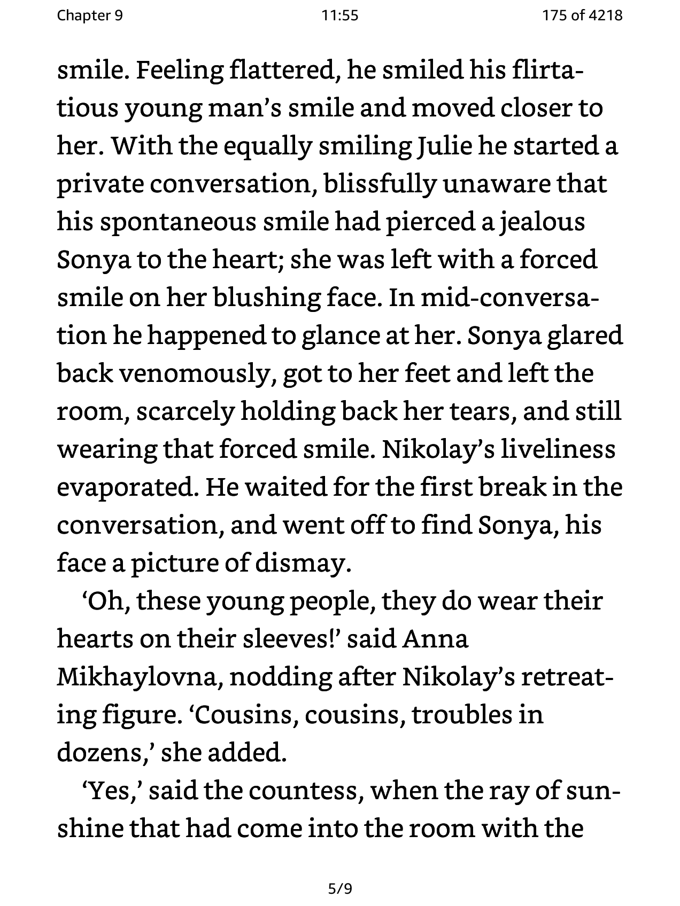

This patch is to change how the status bar at the top looks in KOReader.

# Steps to activate the patch

1. Create a folder called `patches` in your KOReader directory (if not already there)
2. Download the file named `2-reader-header-centered.lua`
3. Move/paste the file in the `patches` directory
 
 
 

  

